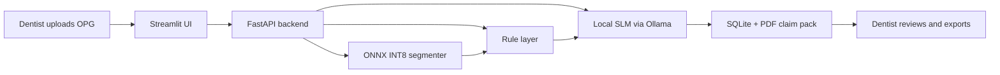

# Dental OPG Anomaly Detection and Insurance Pre-Authorization Engine

A privacy-first desktop tool that reads a dental panoramic X-ray (OPG), marks the problem teeth, and drafts an insurance pre-authorization note. Everything runs on the clinic's own computer. No patient image is uploaded anywhere.

> **Status:** work in progress (mini project, GLA University, Mathura). The synopsis is done and the build is under way. Features below are marked as planned or done as the repo grows.

**Team XYNPASE**

| Member | Roll No. | Role |
|---|---|---|
| Krishnam Gupta | 12515500237 | Team Lead, ML Engineer |
| Keshav Pundhir | 12515500222 | Backend and AI Integration, Researcher |
| Hariom | 12515500167 | Frontend, Testing, Documentation and Researcher |

---

## Why we are building this

Dentists take a panoramic X-ray for almost every new patient. When a treatment needs insurance approval, the claim goes out with the image, a tooth number and a short written reason. In a busy clinic that last part gets rushed, and weak documentation is a common reason claims are sent back.

Cloud AI tools can help, but they mean uploading full-mouth patient scans to someone else's server. Many small clinics cannot accept that because of privacy rules (HIPAA, GDPR, India's DPDP Act 2023) and per-scan costs.

So the idea is simple: do the reading and the writing locally, and keep the dentist in charge.

## What it does

1. You upload an OPG image.
2. A segmentation model finds and outlines pathology on each tooth and tags it with its FDI tooth number (for example, tooth 36).
3. A rule layer turns the findings into structured data: tooth, condition, confidence, urgency, suggested procedure category.
4. A small local language model writes a short pre-authorization narrative from that data.
5. You review and edit everything, then export a PDF claim pack with the marked image and the note.

The language model only rewrites facts it is given. It never decides a tooth number or a diagnosis.

## Features

| Feature | Status |
|---|---|
| OPG upload with basic quality check | Planned |
| Segmentation of caries, deep caries, periapical lesions, impacted teeth | Planned |
| FDI tooth numbering | Planned |
| Interactive viewer (toggle classes, confidence slider) | Planned |
| Local narrative generation with urgency rating | Planned |
| Dentist review and edit before export | Planned |
| PDF claim pack | Planned |
| Bone loss and root-canal failure classes | Phase 2 (limited public data) |

## How it works



## Tech stack

| Part | Tools |
|---|---|
| Segmentation | YOLOv8-seg (Ultralytics, PyTorch), MobileNetV3-U-Net as a fallback |
| Training | Google Colab (T4 GPU), OpenCV, Albumentations |
| Optimisation | ONNX, ONNX Runtime, INT8 quantisation |
| Language model | Qwen2.5-3B-Instruct or Phi-3-mini (about 3.8B) through Ollama |
| Backend | FastAPI, Pydantic |
| Frontend | Streamlit |
| Reports | ReportLab or WeasyPrint |
| Storage | SQLite |

## Datasets

We use public, anonymised data only.

- **DENTEX (MICCAI 2023):** OPGs with FDI numbering and four classes (caries, deep caries, periapical lesion, impacted tooth). Released under CC-BY-NC-SA, so use is non-commercial.
- **Tufts Dental Database:** 1000 OPGs with expert labels for teeth and abnormalities.
- **Supporting sets:** a multi-centre set for impacted teeth, periodontitis and caries, and a small six-class OPG set.

DENTEX has bounding boxes, not masks, and no bone-loss or root-canal label. Where we need masks we generate them and have them checked. Bone loss and root-canal failure come in phase 2.

Datasets are **not** stored in this repo. See `data/README.md` for download steps once added.

## Project structure (planned)

```
.
├── data/              # dataset notes and download scripts (no images committed)
├── training/          # Colab notebooks, training and evaluation scripts
├── models/            # exported ONNX models (not committed if large)
├── backend/           # FastAPI app, rule layer, prompt templates
├── frontend/          # Streamlit app
├── reports/           # PDF templates
├── tests/             # unit and pipeline tests
├── docs/              # synopsis, diagrams, screenshots
└── README.md
```

## Getting started

These steps will work once the code is pushed. Until then treat them as the plan.

**1. Clone and set up Python**

```bash
git clone https://github.com/krishnamgupta29/Miniproject-.git
cd Miniproject-
python -m venv venv
source venv/bin/activate        # Windows: venv\Scripts\activate
pip install -r requirements.txt
```

**2. Install the local language model**

Install [Ollama](https://ollama.com), then:

```bash
ollama pull qwen2.5:3b-instruct
```

**3. Add the trained model**

Place the exported segmentation model at `models/opg_seg_int8.onnx`.

**4. Run**

```bash
uvicorn backend.main:app --port 8000
streamlit run frontend/app.py
```

Open the Streamlit link in your browser, upload an OPG and follow the screen.

## Training and export (for developers)

```bash
# fine-tune on Colab
yolo segment train data=opg.yaml model=yolov8n-seg.pt epochs=100 imgsz=1024

# export to ONNX with INT8 quantisation
yolo export model=runs/segment/train/weights/best.pt format=onnx int8=True data=opg.yaml
```

## Targets and results

We set targets from published DENTEX results and will fill the last column as we measure.

| Metric | Target | Measured |
|---|---|---|
| Tooth numbering (FDI) accuracy | at least 90% | to be filled |
| F1, caries and impacted tooth | about 0.85 or better | to be filled |
| F1, periapical lesion and deep caries | about 0.55 to 0.65 | to be filled |
| CPU inference, segmentation | 500 ms or less (50 ms is a stretch goal) | to be filled |
| Invented findings in narratives | 0 in 50 test cases | to be filled |

## Limitations (please read)

- This is an academic prototype. It is **not** a cleared medical device and must not be used for real diagnosis or billing.
- A dentist must review every finding and every sentence before anything is exported.
- Some insurers ask for periapical or bitewing X-rays for certain procedures. An OPG alone will not satisfy every payer, so the tool supports documentation but cannot promise approval.
- Periapical lesions and deep caries are hard classes. Expect lower accuracy there than on caries and impacted teeth.
- The CDT dental procedure code set is copyrighted by the ADA. The prototype uses a small, clearly labelled mapping for demonstration. Commercial use would need an ADA licence.

## Roadmap

- [ ] Data pipeline and training notebooks
- [ ] Segmentation and FDI numbering
- [ ] ONNX INT8 export and CPU benchmark
- [ ] Rule layer and prompt templates
- [ ] FastAPI backend and Streamlit UI
- [ ] PDF claim pack
- [ ] Testing and evaluation report
- [ ] Phase 2: bone loss and root-canal failure
- [ ] Future: bitewing and periapical support, practice-software integration

## Key references

- Hamamci et al., *DENTEX: Dental Enumeration and Tooth Pathosis Detection Benchmark for Panoramic X-rays*, arXiv:2305.19112 — https://arxiv.org/pdf/2305.19112
- DENTEX dataset — https://zenodo.org/records/7812323
- Tufts Dental Database — https://tdd.ece.tufts.edu/
- WHO, Oral health fact sheet — https://www.who.int/News-Room/Fact-Sheets/Detail/Oral-Health
- Delta Dental, claim documentation gaps — https://www1.deltadentalins.com/dentists/fyi-online/2026/complete-documentation-for-claims.html
- Ultralytics ONNX INT8 export — https://community.ultralytics.com/t/new-release-ultralytics-v8-4-60/2023

The full list with links is in the project synopsis (`docs/`).

## License

Code license to be decided by the team. Dataset licenses stay with their owners (DENTEX is CC-BY-NC-SA).

## Contact

Team XYNPASE, GLA University, Mathura.
Repository owner: [@krishnamgupta29](https://github.com/krishnamgupta29)
